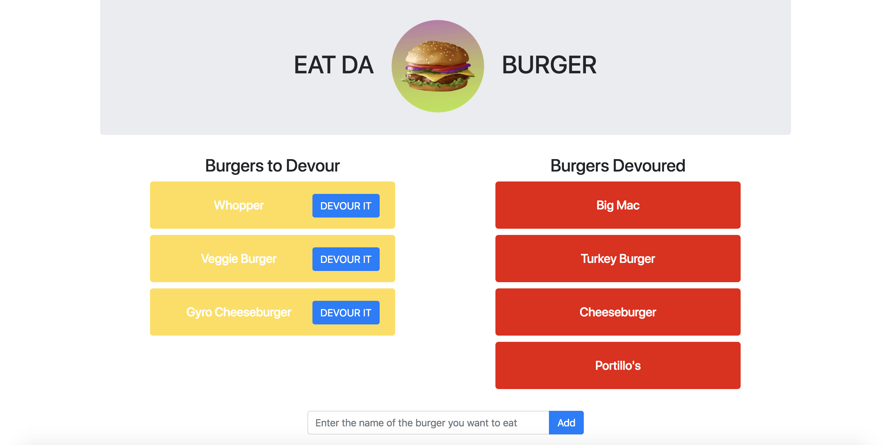

# :hamburger: Eat-Da-Burger!
Eat-Da-Burger! is a simple, full-stack restaurant app that lets users input the names of burgers they'd like to devour.

#### Languages/Technologies Used
- HTML/CSS (Bootstrap)
- JavaScript/jQuery
- MySQL
- Node.js
- Express
- Express Handlebars (HTML templating)

## Demo

The demo of the burger eating application can be found [here](https://eat-da-burger-es.herokuapp.com/).

## Installation

To run the application locally, first clone this repository with the following command.

	git clone git@github.com:esiddi4/Eat-Da-Burger.git
	
Next, install the application dependencies.

	cd Eat-Da-Burger/
	npm install
	
Finally, run the node server locally.

	node server
	
Now, open the local application on port 8080 at the URL: `http://localhost:8080/`.

### Screenshot
